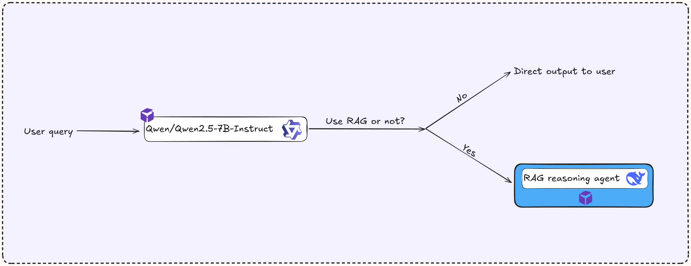
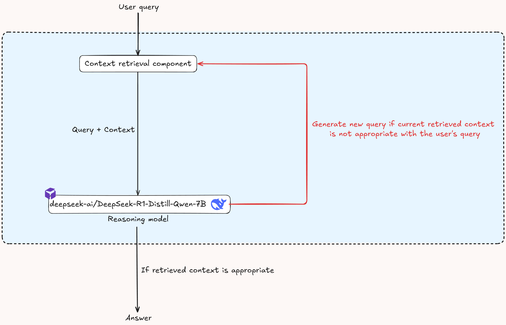
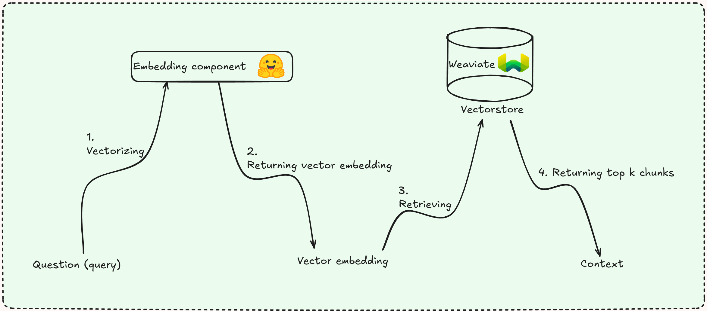

# **Triển khai quy trình Agentic RAG trên K8s với Jenkins để trả lời câu hỏi về Luật Giao Thông Việt Nam**

## I. Giới thiệu

### Động lực

Trong dự án này, mình xây dựng một pipeline Agentic RAG hoàn toàn từ đầu mà không sử dụng các framework như LangChain hay LlamaIndex. Cách tiếp cận này giúp mình hiểu rõ các khái niệm cốt lõi về RAG, thiết kế agent, cũng như cách tích hợp mô hình ngôn ngữ lớn (LLM) với các thành phần khác. Mình lấy cảm hứng từ bài viết của [Anthropic](https://www.anthropic.com/engineering/building-effective-agents) về việc xây dựng các agent hiệu quả, nhấn mạnh vào thiết kế đơn giản, mô-đun thay vì các framework phức tạp.

### Tổng quan

Hệ thống Agentic RAG tăng cường RAG truyền thống bằng cách đưa ra khả năng ra quyết định tự động, giúp agent AI có thể lặp lại quá trình truy vấn, truy xuất thông tin liên quan và tạo ra phản hồi chính xác, phù hợp hơn với ngữ cảnh. Mình triển khai một ứng dụng Agentic RAG liên tục trên Google Kubernetes Engine (GKE) sử dụng pipeline CI/CD. Đây là một dấu mốc quan trọng trong hành trình trở thành Kỹ sư Học máy (MLE) của mình, với nền tảng kiến thức và kỹ năng có được từ khóa học [Full Stack Data Science](https://fullstackdatascience.com/).


### Công nghệ sử dụng

* Kiểm soát mã nguồn: Git/Github
* CI/CD: Jenkins
* API: FastAPI
* Đóng gói ứng dụng: Docker
* Điều phối container: Kubernetes (K8s)
* Quản lý gói cho K8s: Helm
* Lưu trữ dữ liệu vector: Weaviate
* Ingress Controller: NGINX
* Giám sát & theo dõi: Prometheus, Loki, Grafana, Jaeger
* Cơ sở hạ tầng như mã: Ansible & Terraform
* Nền tảng đám mây: Google Cloud Platform (GCP)
* LLM serverless inference: [RunPod](https://www.runpod.io)

### Mô hình học máy

* Mô hình nhúng: [Vietnamese Embedding Model](https://huggingface.co/dangvantuan/vietnamese-embedding)
* LLM cho Primary-agent: [Qwen/Qwen2.5-7B-Instruct](https://huggingface.co/Qwen/Qwen2.5-7B-Instruct)
* LLM cho RAG-agent: [deepseek-ai/DeepSeek-R1-Distill-Qwen-7B](https://huggingface.co/deepseek-ai/DeepSeek-R1-Distill-Qwen-7B)

### Dữ liệu

* Nguồn dữ liệu: [Văn bản Luật Giao thông Việt Nam (PDF)](https://congbao.chinhphu.vn/tai-ve-van-ban-so-08-vbhn-vpqh-40454-47126?format=pdf)

---

## II. Kiến trúc quy trình Agentic RAG

### Tổng quan

Quy trình Agentic RAG là một trợ lý số được thiết kế để xử lý cả các câu hỏi tổng quát và câu hỏi chuyên sâu về Luật Giao thông Việt Nam. Hệ thống sử dụng API LLM kết hợp với thành phần truy xuất ngữ cảnh để tạo ra phản hồi chính xác.

### Kiến trúc Primary Agent



* **Logic quyết định**: agent chính quyết định khi nào cần dùng đến pipeline RAG để tiết kiệm tài nguyên.
* **Trả lời trực tiếp**: với câu hỏi đơn giản, mô hình phản hồi trực tiếp.
* **Gọi agent RAG**: với câu hỏi phức tạp hoặc chuyên ngành (như Luật Giao thông), hệ thống chuyển sang tác nhân RAG.

### Kiến trúc RAG Agent



* **Tích hợp ngữ cảnh**: nhận truy vấn + ngữ cảnh từ hệ thống truy xuất.
* **Tinh chỉnh lặp lại**: nếu ngữ cảnh không đủ, agent sẽ điều chỉnh truy vấn và truy lại thông tin.
* **LLM reasoning**: LLM sẽ suy luận để tạo ra câu trả lời chi tiết và chính xác hơn.

### Thành phần truy xuất ngữ cảnh



Được xây dựng từ đầu để hiểu rõ quy trình RAG.

---

## III. Tạo Cluster GKE bằng Terraform

1. Tạo dự án trên [GCP](https://console.cloud.google.com/) và bật GKE
2. Cài `gcloud CLI` và `auth-plugin` theo [hướng dẫn](https://cloud.google.com/sdk/docs/install#deb)
3. Bật API và cấu hình dự án:

```bash
gcloud services enable container.googleapis.com --project=<your_project_id>
gcloud config set project <your_project_id>
```

4. Sử dụng Terraform để tạo GKE:

```bash
cd infra/terraform
terraform init
terraform plan
terraform apply
```

5. Kết nối GKE từ terminal (như hướng dẫn trong UI GCP)

---

## IV. Triển khai các dịch vụ thủ công

1. **Triển khai NGINX Ingress Controller**

```bash
helm upgrade --install nginx-ingress ./nginx-ingress --namespace nginx-system --create-namespace
```

2. **Triển khai mô hình nhúng văn bản**

```bash
helm upgrade --install text-vectorizer ./application-helm-chart/helm-embedding --namespace emb --create-namespace
```

3. **Triển khai cơ sở dữ liệu vector**

```bash
helm upgrade --install weaviate ./weaviate --namespace weaviate --values ./weaviate/values.yaml --create-namespace
```

→ Sau đó, chuyển dữ liệu từ file PDF vào Weaviate thông qua notebook.

4. **Triển khai truy xuất ngữ cảnh**

```bash
helm upgrade --install retrieval ./application-helm-chart/helm-context-retrieval --namespace context-retrieval --create-namespace
```

5. **Triển khai RAG Agent**

```bash
helm upgrade --install rag-agent ./application-helm-chart/helm-rag-agent --namespace rag-agent --create-namespace
```

6. **Triển khai Primary Agent**
   → Đặt `ingress.host = <external-ip>.nip.io`

```bash
helm upgrade --install primary-agent ./application-helm-chart/helm-primary-agent --namespace primary-agent --create-namespace
```

7. **Chạy thử ứng dụng**
   → Truy cập API docs: `http://<external-ip>.nip.io/docs`
   → Hỏi thử câu hỏi thường và câu hỏi về luật để xem hệ thống hoạt động.

---

## V. Giám sát và quan sát hệ thống

1. **Jaeger + OpenTelemetry**

```bash
helm upgrade --install jaeger-tracing ./jaeger-all-in-one --namespace jaeger-tracing --create-namespace
```

2. **Prometheus + Grafana**

```bash
helm upgrade --install prometheus-grafana-stack -f ./prometheus/values-prometheus.yaml ./prometheus/kube-prometheus-stack --namespace monitoring --create-namespace
```

3. **Loki**

```bash
helm upgrade --install loki -f ./loki/values-loki.yaml ./loki/loki-stack --namespace monitoring --create-namespace
```

→ Theo dõi log, truy vết và biểu đồ hệ thống qua Grafana.

---

## VI. Tạo VM để cài Jenkins bằng Ansible

1. Tải file JSON key của Service Account và cập nhật đường dẫn trong Ansible.
2. Cài Ansible và chạy playbook:

```bash
cd ansible
conda create -n ansible python==3.9 -y
pip install -r requirements.txt
ansible-playbook playbooks/create_compute_instance.yaml
```

3. Tạo cặp khóa SSH, cập nhật vào metadata VM.
4. Build Docker Jenkins có Helm:

```bash
cd custom_image_jenkins
docker build -t <dockerhub>:<tag> .
docker push <dockerhub>:<tag>
```

5. Cài Jenkins qua playbook:

```bash
ansible-playbook -i inventory playbooks/deploy_jenkins.yaml
```

---

## VII. Cấu hình Jenkins

1. **Kết nối với K8s**
   → Dùng `kubectl config view --raw` để lấy thông tin cluster.
   → Tạo ClusterRoleBinding.

2. **Thêm thông tin DockerHub**
   → Tạo access token → Thêm credentials trong Jenkins.

3. **Tăng giới hạn API GitHub**
   → Cài đặt: Never check rate limit

4. **Tạo multibranch pipeline**
   → Kết nối GitHub qua Personal Access Token
   → Jenkins sẽ tự động build khi có code push/pull request

5. **Cài webhook GitHub**
   → Dán URL `http://<jenkins_url>/github-webhook/`

---

Nếu bạn cần bản dịch dạng file `.md`, `.pdf`, hoặc xuất ra HTML trình chiếu, mình có thể hỗ trợ xuất luôn. Muốn dịch thêm phần file script hay code? Cứ nói nhé!
